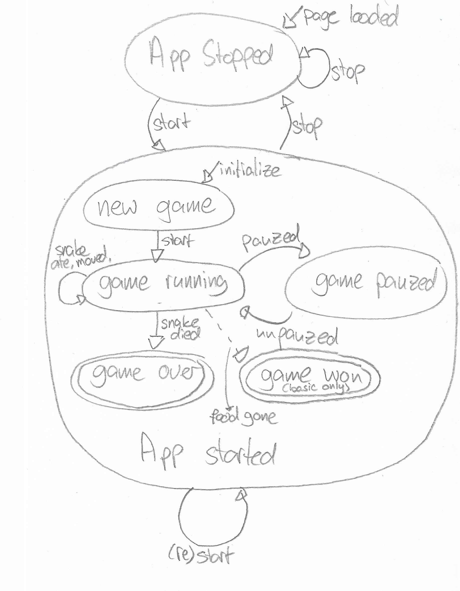

# 12. We use a finite-state machine to maintain game state

Date: 2023-06-13

## Decision

To maintain a sane overview of the state of the game, we use the 
[finite-state machine](https://en.wikipedia.org/wiki/Finite-state_machine) shown below. Note that the _Game Won_ state is only relevant for the basic rule set.

### States of the app
Independent of this, the app itself also maintains a state: Either running or stopped, which corresponds to
the two .html buttons. Starting an already running app results in stopping the game and then starting a new game.  

