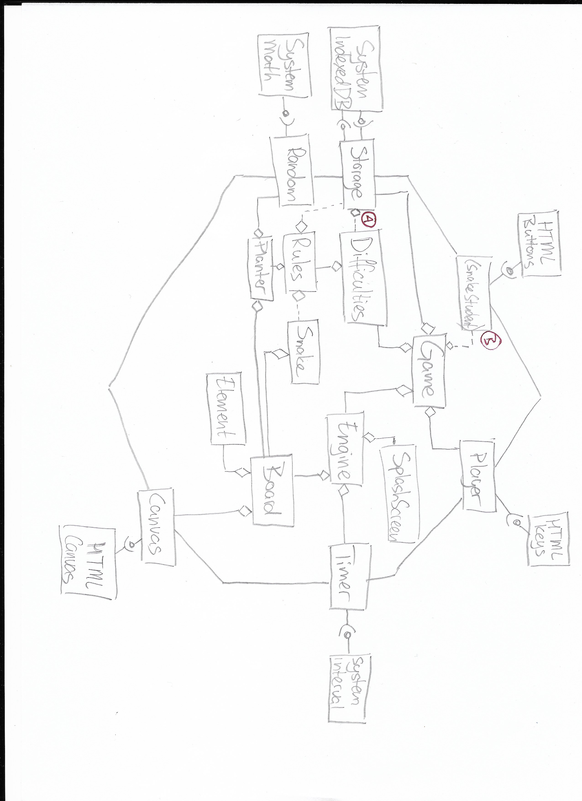

# 14. We modularize our code

Date: 2023-07-01

## Context

We are explicitly required to modularize our code. We already have neatly partitioned our code base due to test-first requirements, but have not introduced modules We adhere to our hexagonal architecture. 

## Decision

We have split our app into separate modules, as per the diagram below. The diagram can be read as follows:

* [A] <>-- contains -- [B], an internal module dependency (UML notation)
* [A] --provides--o )---consumes---[B], a port-adapter interface (see [ADR 11](./0011-we-adhere-to-hexagonal-architecture.md))

Dashed lines denote usage without explicit dependency; that is to say, the module consumes an anonymous interface of another, without knowledge of or dependence on the context.

There are no circular dependencies, i.e. if module A depends on module B, B does not depend on A. Thus, the dependency diagram forms a _tree_, generally flowing downward, from the input above to the output below, the root being _game_.

Please note (A), which would at first blush denote a cyclic dependency: Storage - Rules - Difficulties. However, this is not actually the case due to interface abstraction in [snake_student.js:50](../../web/snake_student.js). Storage has no knowledge of Difficulties. This roundabout construction is necessary due to the poor interface provided by IndexedDB (see [ADR 13](./0013-we-persist-using-an-indexed-database.md)). If we want to be able to let any rule set define its own database interaction scheme, we _must_ provide the database indices beforehand.

Another interesting interaction occurs at (B). _snake_student.js_, whose main job is to build the injection context of the app, binds external input handling directly onto _game_. In this way, it becomes the port for this input-adapter.

Lastly, note that Location has been omitted from this diagram for clarity.

### Responsibilities

We present a brief overview of each module and its responsibility.
We adhere to the [SOLID](https://en.wikipedia.org/wiki/SOLID) principles of design.
In the sense of extensibility (OCP, LSP), we present a common facade to which all the 'subclasses' conform.
For a clear example of this, see [Rule Set](../../web/snake_rule_set.js).

Core modules. These contain the main logic of the game.
* [State](../../web/snake_state.js): Denotes a single state of an [FSM](0012-we-use-a-finite-state-machine-to-maintain-game-state.md).
* [Location](../../web/snake_location.js): Denotes a single coordinate _on the board_ in increments of elements.
* [Element](../../web/snake_element.js): A single piece on the board, with a specific type.
* [Board](../../web/snake_board.js): The game board containing all the elements. Draws on the canvas.
* [Snake](../../web/snake_snake.js): The snake and its actions. Consists of elements on the board. 
* [Engine](../../web/snake_engine.js): The main loop of the game. Maintains the active game FSM. Updates in Timer increments.  
* [Game](../../web/snake_game.js): The main interface of the app. Start and stops games. Handles the difficulty choice.
* [Food](../../web/snake_food.js): Places the food on the board. 
* [Rule Set](../../web/snake_rule_set.js): Contains the specific rules for the game, such as the starting layout, when a game ends, what happens on each tick.

Ports. These provide interfaces onto externals.
* [Canvas](../../web/snake_canvas.js): Interactions with the HTML canvas.
* [Storage](../../web/snake_storage.js): Interactions with the IndexedDB.
* [Random](../../web/snake_random.js): Interface onto the system Math random functions.
* [Timer](../../web/snake_timer.js): Interface onto the system timer. 
* [Player](../../web/snake_player.js): Interface that listens to incoming key events. 

Inversion of Control. 
* [Student](../../web/snake_student.js): Builds the injection context. Also contains the Splash Screen as a shortcut, because of its finicky hard-coded nature.

## Alternatives

### Model-View-Controller architecture

Although this design adheres to all the demands made by the assignment on modular design, it does _not_ implement an MVC architecture. This is an active choice on our part.

The reason for this is that MVC, in its essence, is not intended for problems of this scope. If we return to [the roots of the MVC-design](https://en.wikipedia.org/wiki/Model%E2%80%93view%E2%80%93controller), we find that it is meant for _single input interactions_, e.g. the scope of a single text field.

This pattern has often been abused into full-blown architecture, and as such, has long been considered an anti-pattern. This is because it willfully separates state and operations, going against everything object-oriented programming stands for. [Martin Fowler](https://www.martinfowler.com/bliki/AnemicDomainModel.html) wrote about this over a decade ago. His work is apparently still relevant today.

While Javascript is not in itself an O-O language (it does not adhere to any paradigm),
the design proposed by the course material broadly falls into the category of what Fowler dubs _anemic_:
separating _mutable_ state from its operations. 
The main problem with this, of course, is that these so-called 'model' objects can be mutated by anyone anywhere.
In that sense, they are in fact nothing but glorified global variables!

Instead of copying this faulty design pattern,
we adhere closely to the principles of [SOLID](https://en.wikipedia.org/wiki/SOLID), as well as that of _locality_,
as described by Fowler, or in e.g. Martin's _Clean architectures_ [Mart17]:
_Code that needs to interact often should be grouped._
In this case, state and operations.

In a broader sense, we _do_ adhere to the underlying principles proposed by the assignment:

	Het is de bedoeling dat het domein geheel onafhankelijk is. Het model hoeft dus de rest van de applicatie niet te kennen.

Each of our modules contains one _responsibility_ which is independent and agnostic of every other.
We don't need to separate model and presenter from each other to achieve this.

	De view is het zichtbare deel van de applicatie. In het geval van een webapplicatie bestaat de view uit alle code die er voor zorgt dat de DOM wordt aangepast. In dit geval is dat voornamelijk het canvas. De view is passief. De view wordt door de presenter gevraagd om de DOM te updaten, en krijgt daarvoor de gegevens mee. De view geeft events van de gebruiker door aan de presenter zonder er zelf iets mee te doen.

This corresponds directly to our [Hexagonal architecture](./0011-we-adhere-to-hexagonal-architecture.md).

	Het kan zijn dat je tegen het probleem oploopt dat een module geen gebruik mag maken van methoden van een andere module, volgens de architectuur die je hebt opgesteld, terwijl je dat eigenlijk wel nodig hebt. Je kunt dan communiceren via events.

An event-driven application requires a fundamentally different design.
Using events to circumvent dependencies is a hack and a clear indication of design flaws.
We do not understand why this is presented as a desirable trait.  

We understand that we take a risk by ignoring a course requirement. 
We hope that we have sufficiently shown that we haven't done so lightly,
and that our motivation and design at least meet the underlying requirements, if not exceed them. 
At the very least, we do thoroughly comprehend the course material.

### References

[Mart17] R.C. Martin, _Clean architecture: A Craftsman’s Guide to Software Structure and Design_, 2017
